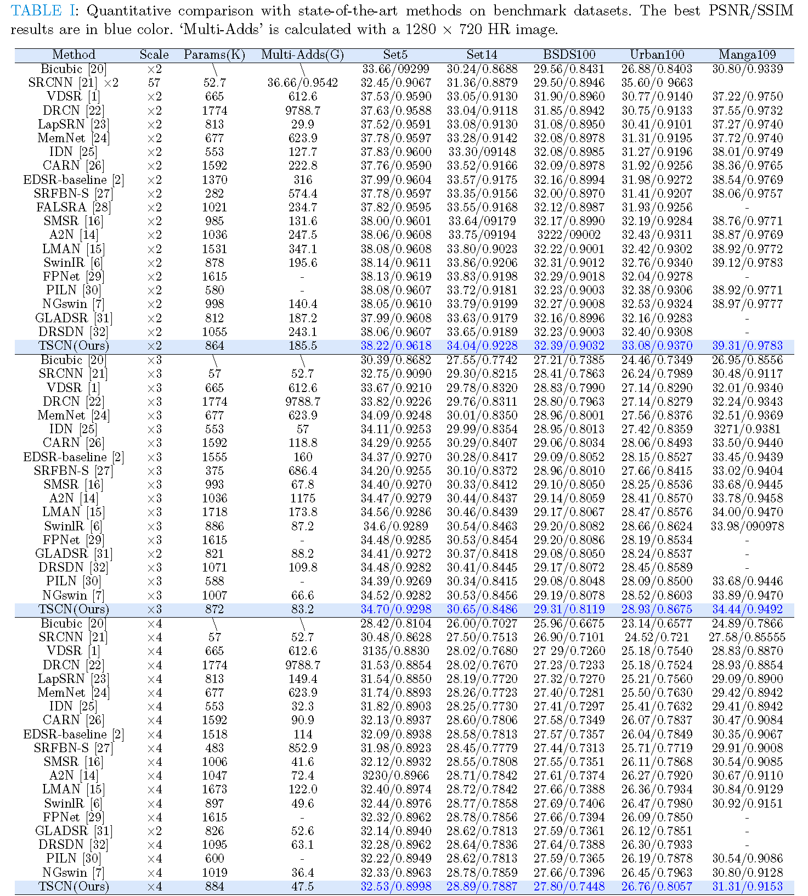
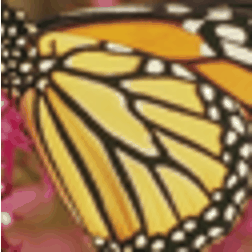

# **Transformer-Style Convolutional Network for Efficient Natural and Industrial Image Super-Resolution**

## :writing_hand: Changelog and ToDos
- [ ] Code and the model pre-training weights.
- [x] Method introduction, model performance and results visualization  :fire::fire::fire:.

## :bulb: Abstract
> **Abstract:** Single image super-resolution (SISR), as an important task in computer vision, plays an indispensable role in both general and industrial scenarios. Significant advancements in SISR have been achieved by leveraging Transformers-based methods, which offer impressive representation capabilities. However, their high computational complexity restricts their usability in resource-constrained devices. Conversely, convolutional networks (ConvNets) inherently possess efficiency but struggle to capture long-range pixel relationships due to their spatial locality. Consequently, there exists a complementary relationship between the representation ability of Transformers and the efficiency of ConvNets, making both crucial for practical applications. Motivated by this observation, we propose a novel Transformer-style convolutional network (TSCN). 
> Firstly, we conduct an analysis of Transformer's advantages, including their capacity for large-range dependencies modeling, two-order feature interactions, inputs self-adaptation, and incorporating advanced components. Drawing insights from this analysis, we utilize these characteristics to guide the design of ConvNets to take full advantage of both. Specifically, we rethink spatial convolution to enhance the modeling of spatial features and modify the macro structure of the Transformer by replacing self-attention (SA) and feed-forward network (FFN) with the large-range multi-order convolution modulation layer (LMCM) and spatial awareness dynamic feature flow layer (SADFF). LMCM integrates re-weighting into large-range convolutional modulation (LCM) technology, allowing self-adaptive recalibration of input features using convolutional features as weight matrices, thus facilitating larger-range dependencies through multi-order feature interactions. Additionally, to address the sub-optimality of FFN, we incorporate key design elements from FFN into SADFF, introducing spatial awareness, locality, and dynamic information flow regulation between layers. Experimental results demonstrate the superior quantitative and qualitative performance of our method.

## :sparkles: Synthetic Image Experiment

	
<strong>Quantitative Comparison with SOTA</strong> (click to expand) 

	

	
<strong>Qualitative Comparison with SOTA</strong> (click to expand) 

    	

		

    	

      		
    	

    	

      		
    	

    	

      		
    	

  		

    	

    	

      		
    	

    	

      		
    	

    	

      		
    	

  		

    	

    	

      		
    	

    	

      		
    	

        

      		
    	

  		

## :sparkles: Real Image Experiment

	
<strong>Quantitative Comparison with SOTA</strong> (click to expand) 

	

	
<strong>Qualitative Comparison with SOTA</strong> (click to expand) 

	

## :sparkles: Visual Analysis

	
<strong>LAM visualization analysis</strong> (click to expand) 

	

	Results of Local Attribution Maps. A more widely distributed red area and higher DI represent a larger range pixels utilization. The heat maps exhibit the area of interest for different SR networks. The red regions are noticed by almost both EDSR, SwinIR, and CARN while the blue areas represent the additional LAM interest areas of the proposed TSCN. (TSCN has a higher diffusion index.)

## :sparkles: Industrial Application

	
<strong>Industrial Application</strong> (click to expand) 

	

	Industrial application of SISR: PCB images and license plate image super resolution for the electronics and autonomous driving industries.
	

	Industrial Application of SISR: contributing to autonomous driving scenario parsing.

 

## :computer: Ablation Study on Micro Design

